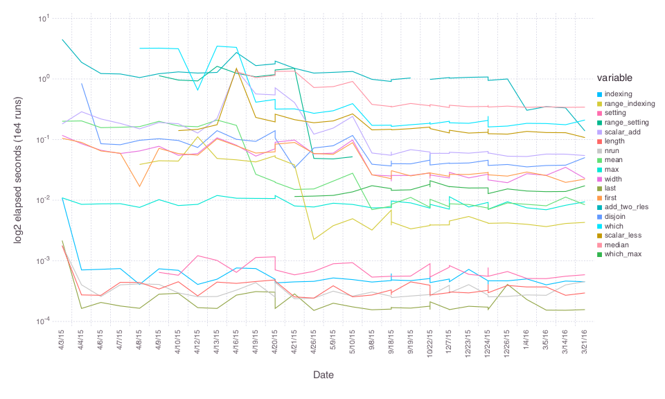

# RLEVectors
`RLEVectors` is an alternate implementation of the Rle type from
Bioconductor's IRanges package by H. Pages, P. Aboyoun and
M. Lawrence. RLEVectors represent a vector with repeated values as the
ordered set of values and repeat extents. In the field of genomics,
data of various types are  measured across the ~3 billion letters in
the human genome can often be represented in a few thousand runs. It
is useful to know the bounds of genome regions covered by these runs,
the values associated with these runs, and to be able to perform
various mathematical operations on these values.

## Background
Bioconductor has some widely used and extremely convenient types for
working with collections of ranges, which sometimes are with
associated data.`IRanges` represents a collection of arbitrary start,
end pairs in [1,Inf). `GRanges` uses `IRanges` to represent locations
on a genome and adds annotation of the chromosome and strand for each
range. Children of `GRanges` add other annotations the the ranges. `Rle`
represents the range [1:n] broken into arbitrary chunks or segments.

## Implementation Details
`RLEVectors` differs from R's `Rle` in that we store the run values
and run ends rather than the run values and run lengths. The run ends
are convenient in that they allow for indexing into the vector by
binary search (scalar indexing is O(log(n)) rather than O(n) ).
Additionally, `length` is O(1) rather than O(n) (it's the last run
end rather than the sum of the run lengths). On the other hand,
various operations do require the run lengths, which have to be
calculated. See the benchmark directory and reports to see how
this plays out.

### Creation
`RLEVectors` can be created from a single vector or a vector of values and a vector of run ends. In either case runs of values or zero length runs will be compressed out. RLEVectors can be expanded to a full vector like a `Range` with `collect`.

```julia
using RLEVectors
x = RLEVector([1,1,2,2,3,3,4,4,4])
collect(x)
y = RLEVector([4,5,6],[3,6,9])
collect(y)
```

### Describing
`RLEVector`s implement the usual descriptive functions for an array as well as some that are
specific to the type.
    
* `length(x)` The full length of the vector, uncompressed
* `size(x)` Same as `length`, as for any other vector
* `size(x,dim)` Returns `(length(x),1) for dim == 1`
* `starts(x)` The index of the beginning of each run
* `widths(x)` The width of each run
* `ends(x)` The index of the end of each run
* `values(x)` The data value for each run
* `isempty(x)` Returns boolean, as for any other vector
* `nrun(x)` Returns the number of runs represented in the array
* `eltype(x)` Returns the element type of the runs
* `endtype(x)` Returns the element type of the run ends

### Standard vector operations

`RLEVector`s can be treated as standard Vectors for arithmetic and collection operations. In many cases these operations are more efficient than operations on a standard vector.

- `x = RLEVector([4,5,6],[3,6,9])`
- `x[2]`
- `x[7:9] = 10`
- `push!(x,6)`
- `x + 2x`
- `unique(x)`
- `findin(x,5)`
- `x > 4.2`
- `sort(x)`
- `median(x)`

## split and tapply -like operations
An RLEVector can be used like R's factor type to apply a function over (contiguous) sections of another
vector. For example, here we break a vector into 5 groups and take the average of each group. In the second
example, we also scale each mean by the RLE run value corresponding to each group.

```julia
factor = repeat( ["a","b","c","d","e"], inner=20 )
rle = RLEVector( factor )
x = collect(1:100)
group_means = Float64[ mean(x[r]) for (v,r) in each(rle) ]
```

This is much like the `tapply` operation in R. A convenience wrapper with this name is provided. The second,
factor, argument can be an `RLEVector` or a `Vector` to be converted to an `RLEVector`. This vector need not be
sorted.

```julia
tapply( x, factor, mean )
tapply( x, rle, mean )
```

In addition to the `Range` for each RLE run, the `each` iterator provides the corresponding run value. These
values can be used in calculations on each vector block.

```julia
x = collect(1:100)
rle2 = RLEVector( repeat( [1,2,3,4,5], inner=20 ) )
scaled_group_means = Float64[ v * mean(x[r]) for (v,r) in each(rle2) ]
```

## Relative speed
`RLEVectors` has been extensively profiled and somewhat optimized. Please see the benchmarking section for the evolution over time and comparisons to like operations in R.

### Benchmarks
** Please note that these benchmarks include data structure / algorithmic differences as well as language
differences ** For example, indexing is O( log(n) ) in RLEVectors.jl and O(n) in the original R
implementation. Similarly, `last` is a simple lookup in RLEVectors.jl where `width` is a lookup in the R
version. Other functions listed here of the same computational order, but not necessarily direct
translations. RLEVectors.jl is written in my interpretation of idiomatic julia.


### Optimization progress


## Memory considerations
Data compression is a secondary benefit of `RLEVector`s, but it can be convenient. Generally run ends are stored as Int64. However, if further memory savings are desired, consider smaller and unsigned types. UInt32 is sufficient to hold the length of the human genome and UInt16 can hold the length of the longest human chromosome.

`RLEVector([5.1,2.9,100.7], UInt16[4,8,22])`

